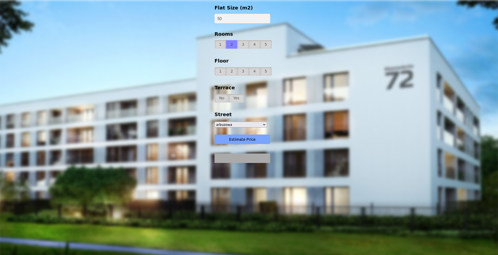

# Flat Price Prediction



## Table of Contents

1. [Project Description](#project-description)
3. [Running the Project](#running-the-project)
4. [Project Structure](#project-structure)

## Project Description

The goal of this project is to create a model for predicting flat rental prices based on available data such as area, number of rooms, floor, presence of a terrace, and more. The model is based on linear regression and has been trained on available data from a CSV file.

## Running the Project

To run the project, follow these steps:

1. Clone the repository to your computer.

2. Navigate to the project folder using the command line.
   
4. Install required libraries
   
   ```shell
   pip install -r requirements.txt

6. Run the Flask server with the following command:

   ```shell
   cd Server
   python server.py
7. Open a web browser and go to the following URL:
   
   ```shell
    http://127.0.0.1:5000/

Project Structure

    flat_price_prediction.ipynb: The main file containing regression models.
    
    server.py: The main file containing routing, and serving the web page

    util.py: A script with functions for handling flat price prediction.

    app.html: The web page template.

    app.js: A JavaScript script responsible for communication with the Flask server and handling the interface.

    app.css: A stylesheet for the web page.

    city_rentals.csv: A CSV file containing data on flat rental prices in the city.
